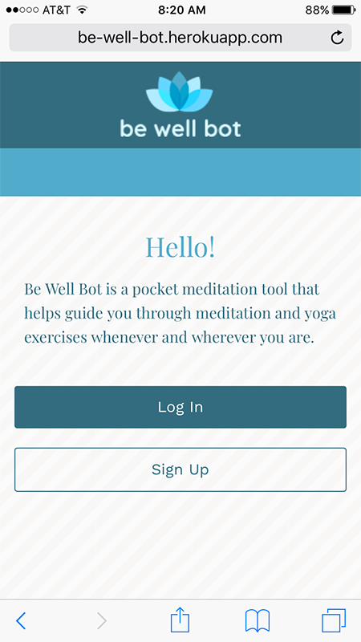
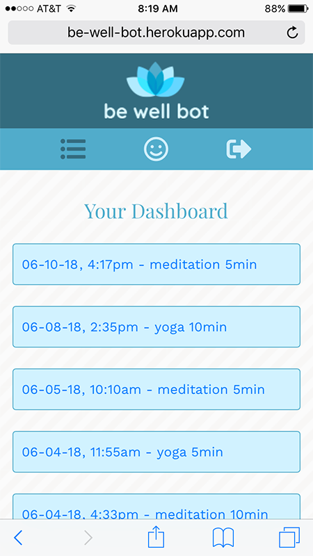
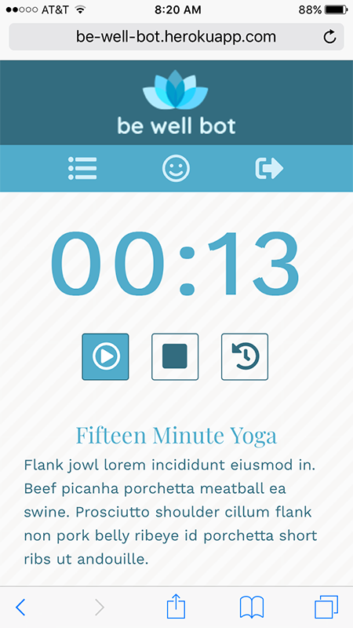

# be well bot

### What is this?

Be Well Bot is a mobile-first application built in React.

### Who's this for?

Everyone has stress in their life. If you say you don't, you're lying. Be Well Bot is a pocket meditation tool to help with that every day stress.

### How does it work?

After user signs up and/or signs in, they are taken to their dashboard that holds all of their completed meditation or yoga sessions. Users can redo a session from the dashboard or go to the sessions menu (smiley face icon) and then choose a timed session.

### Screenshots

##### Welcome Screen

##### Dashboard Screen

##### Session Timer  Screen

### Technologies Applied

* HTML
* Sass/SCSS/CSS
* Bootstrap
* [Create React App](https://github.com/facebookincubator/create-react-app).

    * Below you will find some information on how to perform common tasks. You can find the most recent version of this guide [here](https://github.com/facebookincubator/create-react-app/blob/master/packages/react-scripts/template/README.md).
* Authentication
    * bcrypt
    * Passport
    * Redux
    * Redux-thunk
    * Axios

